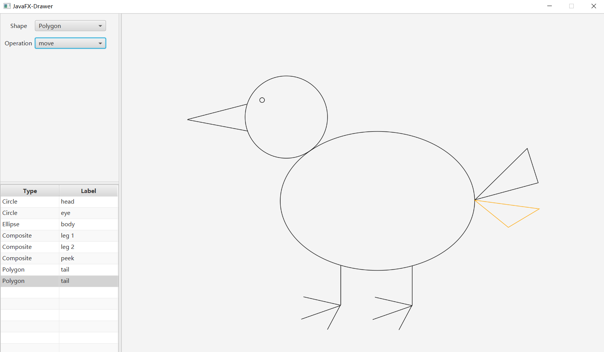

# javafx-drawer

## 引言

本项目基于 JavaFX 实现了一个简单的画图应用，使用 Maven 构建。核心功能包括图元绘制、删除、命名、移动、组合、复制粘贴，以及多步操作撤销和恢复。应用提供了清晰便捷的 GUI 界面，可以方便地使用键盘和鼠标操作。



## 操作方式

### 鼠标

#### 绘制

左键：选取点

右键：结束绘制

#### 移动

按下左键并移动：开始拖拽图元

松开左键：结束拖拽，完成移动操作

#### 图元列表

左键点击左下的图元列表项可以选中图元，选中的图元会显示为橙黄色，可双击图元的 Label 项以编辑。

### 键盘

#### 图元类型选择

Q：选择上一个图元类型

E：选择下一个图元类型

#### 操作类型选择

数字键：选择对应操作类型

A：选择上一个操作类型

D：选择下一个操作类型

#### 图元选择

W：选择上一个图元

S：选择下一个图元

按下 shift 可进行多选

#### 图元操作

Delete：删除选中的图元

Ctrl + C：复制选中的图元

Ctrl + V：粘贴图元

Ctrl + B：组合图元

Ctrl + D：解组合图元

Ctrl + Z：撤销操作

Ctrl + Y：恢复操作

## 系统分析与设计

报告中的包名均省略相同的 `com.gbccccc.javafxdrawer.` 部分。

### 项目结构

本项目分为三个模块：`shape` 包包含多种简单图元类型（坐标无关，与画布低耦合），以及辅助图形操作的 `Point` 类和 `Translation` 类；`gui` 包中的类型会直接调用 JavaFX API，负责界面显示，其中 `DrawerController` 定义 GUI 交互逻辑，`gui.canvas` 包定义了图元显示类型（坐标有关，与画布强耦合并实现了在画布上绘制的方法）即它们的工厂；`log` 包定义了日志类型以实现操作撤销和恢复。

另外，界面样式使用 Scene Builder 绘制，导出至 resources 目录下的 drawer-view.fxml 。

### 系统分析与实现

#### 图元绘制

##### 分析

本应用最复杂的逻辑在于图元的绘制，这个功能需要用户在滑板上选取若干个点用于创建新的图元，结束选取时机包含“用户手动结束选取”和“选取点数已达该图元上限”两个可能，结束后还需判断是否创建成功（即选取点数是否达到该图元下限），同时在鼠标移动时应实时显示图元的预览。

##### 实现

由于图元种类多、图元的创建过程长（用户需要多次选点）、已设定的参数会发生变化（鼠标移动），因此使用了结合了工厂模式和建造者模式的 `CanvasElementFactory` 类用于图元的创建。用户第一次点击画布时，工厂会根据选择的图元类型和点击位置创建一个最简单的图元显示类型对象；伴随用户的鼠标操作，工厂会维护一个点列表，其中最后一个点表示一个临时点，会根据鼠标移动而变化，每当此列表发生变化时，工厂会将此列表交给图元显示类型对象，让它自行处理选点列表；另外，图元工厂向上层提供了一个方法用于绘制正在创建的临时图元。

由于结束的时机和行为不统一，上层难以在与用户交互的同时预判绘制的结束，因此上层需要使用观察者模式的回调机制异步获取完全创建完成的图元对象。`CanvasElementFactory` 维护了一个实现了 `ElementFactoryListener` 的对象的引用，而 `DrawerController` 实现了该接口：

```Java
public interface ElementFactoryListener {
    void onBuildingFinished(CanvasElement element);

    void onBuildingChanged();
}
```

第一个方法在创建中的临时图元发生变化被调用，`DrawerController` 在此时重绘画布；第二个方法在图元创建结束且成功时被调用，`DrawerController` 在此时将新图元加入图元列表。

另外，`CanvasElementFactory` 使用了懒汉式的单例模式向 `CanvasElementFactory` 提供功能。

#### 复制粘贴

##### 分析

本应用提供了图元复制粘贴的功能，采用的方案是一次复制，多次粘贴，并且在被复制图元被修改后粘贴的仍是修改前的原对象，支持多图元的复制粘贴。

##### 实现

可以利用 Java 提供的 `Clonable` 接口方便地实现简单的原型模式（组合图元 `CompositeElement` 略微特殊）。应用会维护一个被复制图元列表，在复制时，调用所有被选中图元的 `clone` 方法获取图元拷贝加入列表，粘贴时将列表中的图元拷贝加入总图元列表中，之后再调用所有这些新图元的 `clone` 方法获取新一批图元拷贝，用于可能的下一次粘贴，以下为粘贴的逻辑：

```Java
if (copiedElements.isEmpty()) {
    return;
}

addElements(copiedElements);

// prepare new copies for the possible next paste
List<CanvasElement> tempCopiedElements = new ArrayList<>(copiedElements);
copiedElements.clear();
for (CanvasElement element : tempCopiedElements) {
    copiedElements.add(element.clone());
}
```

#### 图元组合

##### 分析

本应用提供了图元组合的功能，组合图元应当能提供与其他基本图元完全相同的功能，还额外提供了解组合的功能。

##### 实现

采用了安全组合模式，`CompositeElement` 与其他基本图元显示类型同样继承自 `CanvasElement` 抽象类，它维护了一个子图元列表，对于图元的公共功能，遍历调用子图元的对应方法即可实现；对于解耦合功能，`CompositeElement` 额外提供了一个 `getChildren` 方法，用于获取它的所有子图元。

#### 操作撤销与恢复

##### 分析

本应用提供了操作撤销与恢复功能，相关操作包括图元添加、删除、移动、组合、解组合和修改图元描述，且支持多次撤销恢复。

##### 实现

此功能的实现基于命令模式，但有些许变化。`Log` 抽象类表示操作记录，`LogList` 类型使用了两个栈 `dones` 和 `todos`，分别维护可撤销和可恢复的操作记录：撤销时记录会从 `dones` 弹出，调用 `undo` 方法，再压入 `todos` ；恢复时记录会从 `todos` 弹出，调用 `redo` 方法，再压入 `dones` ；新增记录会被压入 `dones` ，之后会清空 `todos` 。

与传统命令模式的区别在于，操作记录对象的创建、添加到 `LogList` 的时机在相应操作完成之后，因此新增操作记录时不会调用它的 `redo` 方法。这是由于本应用的图元移动功能使用鼠标交互，拖拽时图元会连续地移动，直到鼠标左键松开，对于过程中每一个微小的移动，都通过生成一条命令来移动图元显然是不合理的。因此在操作记录生成时，采用了上层先自行完成操作，再生成操作记录的实现方法。以下为上层生成移动图元记录前的过程，注意即时操作的位移为 `curMousePoint.minus(lastMousePoint)` ，而操作记录的位移为 `curMousePoint.minus(originalMousePoint)` ：

```Java
List<CanvasElement> selectedElements = elementTable.getSelectionModel().getSelectedItems();
if (selectedElements.isEmpty()) {
    return;
}

Point curMousePoint = new Point(mouseEvent.getX(), mouseEvent.getY());
Translation translation = curMousePoint.minus(lastMousePoint);
for (CanvasElement element : selectedElements) {
    element.move(translation);
}

logList.addLog(new MoveLog(selectedElements, curMousePoint.minus(originalMousePoint)));
```

#### 鼠标与键盘事件的处理

##### 分析

本应用需要通过鼠标和键盘进行大量操作，但是 JavaFX 控件对每一种事件只能绑定一个事件处理器，这为实现鼠标和键盘事件的处理带来了不便：鼠标操作涉及绘制和移动两个不同的功能，应用在不同模式下，同一个鼠标事件类型的处理逻辑是不同的；键盘操作涉及多个按键，还要考虑事件发生时组合键 shift、ctrl 的状态，但是 JavaFX 仅为键盘事件定义了一个统一的事件类型。

如果在事件处理中简单地堆叠状态的判断，大量的 if-else 会严重破坏代码的可读性，因此适当的设计在这些事件的处理中很有必要。

##### 实现

JavaFX 中的通过使用事件处理器处理事件，在本场景中，对于不同事件处理逻辑，定义不同的事件处理器才是最合理的实现方法，此时可以使用 `Map` 方便不同的事件处理器管理和使用。

鼠标部分，对于每种鼠标事件类型，都使用 `Map` 维护一个操作类型到事件处理器的映射，鼠标事件总处理器只需根据操作类型使用对于的具体事件处理器即可。一个鼠标事件总处理器的例子如下：

```Java
canvas.setOnMousePressed(
        mouseEvent -> {
            String operation = operationChoiceBox.getValue();
            if (mousePressedHandlers.containsKey(operation)) {
                mousePressedHandlers.get(operation).handle(mouseEvent);
            }
        }
);
```

键盘部分，使用多个 `Map` ，管理不同功能键状态下的事件处理器，每个 `Map` 维护键码到事件处理器的映射，总事件处理器先判断键盘事件的发生时的组合键状态，再使用对于的 `Map` 根据键码获取对应的具体事件处理器。键盘事件总处理器代码如下：

```Java
mainScene.setOnKeyPressed(
		keyEvent -> {
		    Map<KeyCode, EventHandler<KeyEvent>> keyHandlers;
		    if (!keyEvent.isControlDown() && !keyEvent.isShiftDown() && !keyEvent.isAltDown()) {
		        keyHandlers = keyOwnHandlers;
		    } else if (keyEvent.isShiftDown() && !keyEvent.isControlDown() && !keyEvent.isAltDown()) {
		        keyHandlers = keyWithShiftHandlers;
		    } else if (keyEvent.isControlDown() && !keyEvent.isShiftDown() && !keyEvent.isAltDown()) {
		        keyHandlers = keyWithControlHandlers;
		    } else {
		        // other ctrl, shift, alt combinations do not make sense
		        return;
		    }

		    if (keyHandlers.containsKey(keyEvent.getCode())) {
		        keyHandlers.get(keyEvent.getCode()).handle(keyEvent);
		    }
		}
);
```

